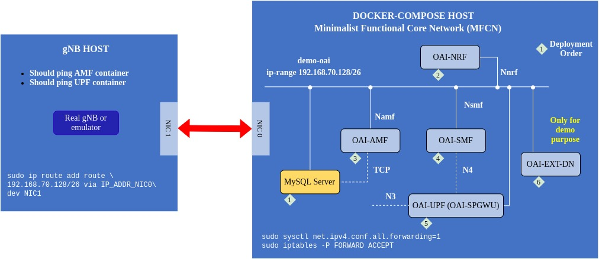

# Setup Schematic

# 1. Start 5G Standalone Mini Core Network (CN) with NRF

The openairinterface 5G core federation repository is located at [https://gitlab.eurecom.fr/oai/cn5g/oai-cn5g-fed](https://gitlab.eurecom.fr/oai/cn5g/oai-cn5g-fed).

Pull the images and install the prerequisites according to [here](https://gitlab.eurecom.fr/oai/cn5g/oai-cn5g-fed/-/blob/master/docs/DEPLOY_HOME.md).

We choose a mini deployment with NRF as described [here](https://gitlab.eurecom.fr/oai/cn5g/oai-cn5g-fed/-/blob/master/docs/DEPLOY_SA5G_MINI_DS_TESTER_DEPLOYMENT.md).

1. Configure the core network

		sudo vim ~/oai-cn5g-fed/docker-compose/docker-compose-mini-nrf.yaml
		
	Attention to the `AMF` parameters. Especially `PLMN_SUPPORT_MCC`, `PLMN_SUPPORT_MNC`, `PLMN_SUPPORT_TAC`, `SST_0`, `SD_0`, `SST_1`, and `SD_1`. These parameters must be set similar to gnb.

2. Deploy 

		cd ~/oai-cn5g-fed/docker-compose/
		python3 ./core-network.py --type start-mini --fqdn no --scenario 1
		
	Undeploy

		cd ~/oai-cn5g-fed/docker-compose/
		python3 ./core-network.py --type stop-mini
		
	See all the options
	
		python3 core-network.py --help

# 2. Start 5G Base Station (gNodeB)

1. Pull enb docker image and clone this repository

		docker pull rdefosseoai/oai-gnb:develop
		git clone git@github.com:samiemostafavi/oai-all-in-docker.git
		cd ~/oai-all-in-docker/gnodeb

	Check whether the USRP device is connected on the docker host (if uhd drivers are installed)
	
		uhd_find_devices
		
	Check whether gnb container connection to AMF and UPF(SPGW-C)
	
		docker-compose up check-gnb-connections
 		docker rm -f check-gnb-connections
	
2. Modify the configuration file		

	Currently, there is no config file provided for standalone USRP B210 106PRB. Therefore, the config file provided in the repository `gnodeb/gnb.conf` is a combination of non-standlaone B210 106PRB config file and standalone N310 106PRB config files in the links below.

		https://gitlab.eurecom.fr/oai/openairinterface5g/-/blob/develop/ci-scripts/conf_files/gnb.band78.tm1.fr1.106PRB.usrpb210.conf
		https://gitlab.eurecom.fr/oai/openairinterface5g/-/blob/develop/ci-scripts/conf_files/gNB_SA_n78_106PRB.2x2_usrpn310.conf
	
	* Modify `plmn_list` which consists of `MCC`, `MNC`, `TAC` (tracking_area_code), and `snssai` List of (`sst`,`sd`)s so it matches AMF configuration.
	* Modify `CI_AMF_IP_ADDR` to AMF ip.
	* Modify `CI_GNB_IP_ADDR` of `NETWORK_INTERFACES` section and set an arbitrary ip address for gnb server in the demo-oai-public-net subnet. NOTE: if you are runing enb on the same machine, `GNB_INTERFACE_NAME_FOR_*` is not important. Otherwise, set it properly.
	
3. Deploy

		cd ~/oai-all-in-docker/gnodeb		
		docker-compose up oai-gnb

	Undeploy
	
		cd ~/oai-all-in-docker/gnodeb
		docker-compose down

	NOTE: For USRP B210, you should use `-E` after the config file while running the nr-softmodem. Otherwise you get sampling rate not supported error.

# 2. Start NR-UE

1. Pull nr-ue docker image and clone this repository

		docker pull rdefosseoai/oai-nr-ue:develop
		git clone git@github.com:samiemostafavi/oai-all-in-docker.git
 		cd ~/oai-all-in-docker/nr-ue
		
	Check whether the USRP device is connected on the docker host (if uhd drivers are installed)
	
		uhd_find_devices
	
2. Modify the configuration file

		https://gitlab.eurecom.fr/oai/openairinterface5g/-/blob/develop/ci-scripts/conf_files/ue.sa.conf

	For more information read more in the following links:

		https://gitlab.eurecom.fr/oai/openairinterface5g/-/tree/develop/ci-scripts/yaml_files/5g_rfsimulator
		https://gitlab.eurecom.fr/oai/openairinterface5g/blob/develop/doc/RUNMODEM.md
