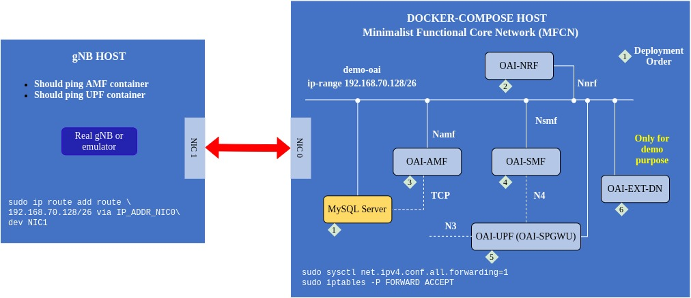

# Setup Schematic

# 1. Start 5G Standalone Mini Core Network (CN) with NRF

The openairinterface 5G core federation repository is located at [https://gitlab.eurecom.fr/oai/cn5g/oai-cn5g-fed](https://gitlab.eurecom.fr/oai/cn5g/oai-cn5g-fed).

Pull the images and install the prerequisites according to [here](https://gitlab.eurecom.fr/oai/cn5g/oai-cn5g-fed/-/blob/master/docs/DEPLOY_HOME.md).

We choose a mini deployment with NRF as described [here](https://gitlab.eurecom.fr/oai/cn5g/oai-cn5g-fed/-/blob/master/docs/DEPLOY_SA5G_MINI_DS_TESTER_DEPLOYMENT.md).

1. Configure the core network

		sudo vim ~/oai-cn5g-fed/docker-compose/docker-compose-mini-nrf.yaml
		
	Attention to the `AMF` parameters. Especially `PLMN_SUPPORT_MCC`, `PLMN_SUPPORT_MNC`, `PLMN_SUPPORT_TAC`, `SST_0`, `SD_0`, `SST_1`, and `SD_1`. These parameters must be identical in `AMF`, gnb, and UE configurations.

2. Deploy 

		cd ~/oai-cn5g-fed/docker-compose/
		python3 ./core-network.py --type start-mini --fqdn no --scenario 1
		
	Undeploy

		cd ~/oai-cn5g-fed/docker-compose/
		python3 ./core-network.py --type stop-mini
		
	See all the options
	
		python3 core-network.py --help

# 2. Start 5G Base Station (gNodeB)

1. Pull enb docker image and clone this repository

		docker pull rdefosseoai/oai-gnb:develop
		git clone git@github.com:samiemostafavi/autoran.git
		cd ~/autoran/autoran/oainr/gnodeb

	Check whether the USRP device is connected on the docker host (if uhd drivers are installed)
	
		uhd_find_devices
		
	Check whether gnb container connection to AMF and UPF(SPGW-C)
	
		docker-compose up check-gnb-connections
 		docker rm -f check-gnb-connections
	
2. Modify the configuration file		

	For USRP B210, use the following configuration file. It starts a 106 prb 5G network over band 78:
	
		https://gitlab.eurecom.fr/oai/openairinterface5g/-/blob/develop/targets/PROJECTS/GENERIC-NR-5GC/CONF/gnb.sa.band78.fr1.106PRB.usrpb210.conf
	
	Copy the config file to `autoran/oainr/gnodeb`.
	
	* Modify `plmn_list` which consists of `MCC`, `MNC`, `TAC` (tracking_area_code), and `snssai` List of (`sst`,`sd`)s so it matches AMF configuration.
	* Modify `CI_AMF_IP_ADDR` to AMF ip.
	* Modify `CI_GNB_IP_ADDR` of `NETWORK_INTERFACES` section and set an arbitrary ip address for gnb server in the demo-oai-public-net subnet. NOTE: if you are runing enb on the same machine, `GNB_INTERFACE_NAME_FOR_*` is not important. Otherwise, set it properly.
	* Make sure it contains `min_rxtxtime = 6;` line.

3. Deploy

		cd ~/autoran/autoran/oainr/gnodeb
		docker-compose up oai-gnb

	Undeploy
	
		cd ~/autoran/autoran/oainr/gnodeb
		docker-compose down
	
	Running the modem command:
	
		/opt/oai-gnb/bin/nr-softmodem.Rel15 -O /opt/oai-gnb/gnb.conf -E  --sa
	
	* `-sa` option enables standalone 5G.
	* `-E` option enables 106 PRBs of numerology 1 for USRP B210.

# 2. Start NR-UE

1. Pull nr-ue docker image and clone this repository

		docker pull rdefosseoai/oai-nr-ue:develop
		git clone git@github.com:samiemostafavi/oai-all-in-docker.git
 		cd ~/oai-all-in-docker/nr-ue
		
	Check whether the USRP device is connected on the docker host (if uhd drivers are installed)
	
		uhd_find_devices
	
2. Modify one of the configuration files

		https://gitlab.eurecom.fr/oai/openairinterface5g/-/blob/develop/ci-scripts/conf_files/ue.sa.conf
		https://gitlab.eurecom.fr/oai/openairinterface5g/-/blob/develop/targets/PROJECTS/GENERIC-NR-5GC/CONF/ue.conf
		
	Copy it to `autoran/oainr/nr-ue`.
	* Make sure `IMSI`, `st`, and `sd` are matched with AMF and gnb configuration.
	* Generate the `key` parameter from `imsi` and `opc` (operator key).
	
3. Deploy

		cd ~/autoran/autoran/oainr/nr-ue
		docker-compose up oai-nr-ue

	Running the modem command:
	
		nr-uesoftmodem.Rel15 -O /app/ue.sa.conf -E -r 106 --numerology 1 --band 78 -C 3619200000 -s 516 --sa --nokrnmod --ue-rxgain 120 --ue-txgain 0 --ue-max-power 0 --ue-fo-compensation
		
	* `-r` sets the number of PRBs
	* `-s` sets the SSB start subcarrier.
	* `--nokrnmod` must be there to create the tunnel without kernel mode.
	* `--ue-fo-compensation` is needed, it enables the frequency offset compenstation.
	* `-E` option enables 106 PRBs of numerology 1 for USRP B210.

4. Undeploy

		cd ~/autoran/autoran/oainr/nr-ue
		docker-compose down

Reference documents:

	https://gitlab.eurecom.fr/oai/openairinterface5g/-/blob/develop/doc/RUNMODEM.md#run-oai-in-sa-mode
	https://gitlab.eurecom.fr/oai/openairinterface5g/-/blob/develop/doc/TESTING_5GSA_setup.md
	https://openairx-labs.northeastern.edu/deploying-oai-in-5g-standalone-mode/
	https://gitlab.eurecom.fr/oai/openairinterface5g/-/tree/develop/ci-scripts/yaml_files/5g_rfsimulator
	https://gitlab.eurecom.fr/oai/openairinterface5g/blob/develop/doc/RUNMODEM.md

